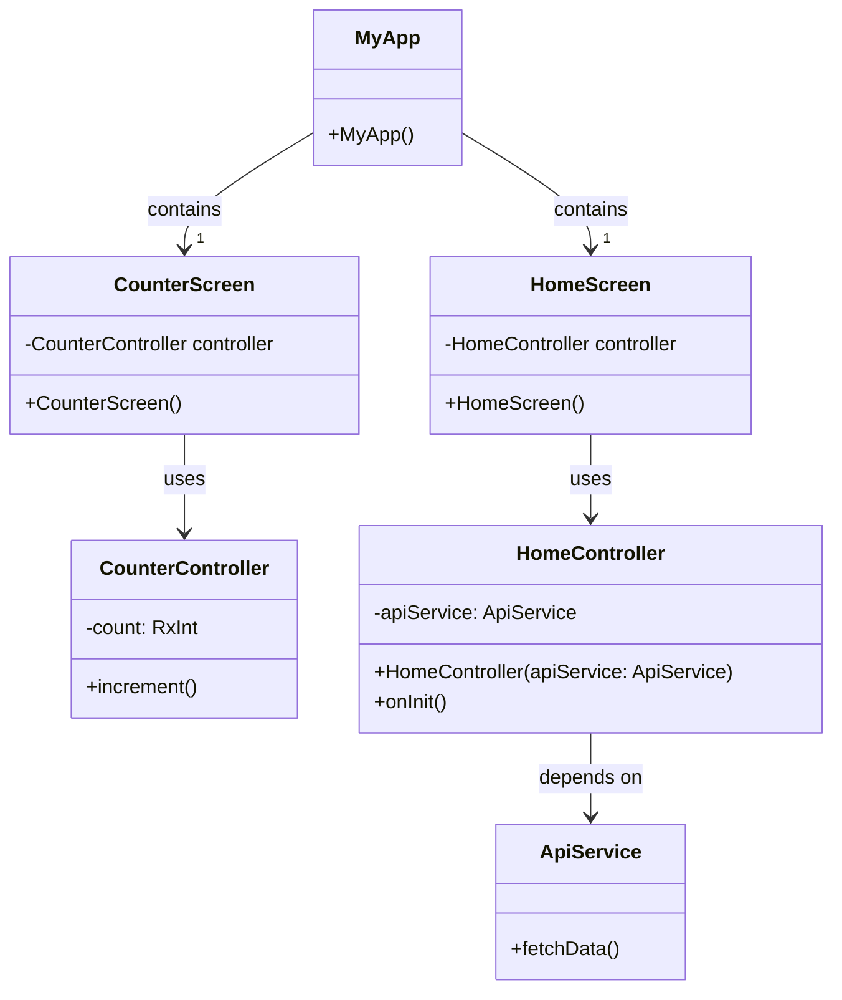

以下是針對 Flutter 中使用 GetX 的教學文件：

# Flutter GetX 教學文件

## 簡介

GetX 是一個功能強大且易於使用的 Flutter 狀態管理工具包。它提供了一種簡單且高效的方式來管理狀態、依賴注入和路由。

### 為什麼選擇 GetX？

- **簡單易用**：GetX 使用簡單的 API，易於學習和使用。
- **高性能**：GetX 的性能優秀，特別是在大型應用中。
- **多功能**：GetX 提供狀態管理、依賴注入和路由管理等多種功能。

## 安裝

首先，在您的 `pubspec.yaml` 文件中添加 GetX 依賴：

```yaml
dependencies:
  get: ^4.6.1
```

然後運行以下命令來安裝依賴：

```bash
flutter pub get
```

## 基本使用

### 1. 狀態管理

#### 計數器示例

創建一個簡單的計數器應用來展示 GetX 的狀態管理功能。

1. 創建一個控制器類來管理計數器的狀態：

```dart
import 'package:get/get.dart';

class CounterController extends GetxController {
  var count = 0.obs;

  void increment() {
    count++;
  }
}
```

2. 在 UI 中使用這個控制器：

```dart
import 'package:flutter/material.dart';
import 'package:get/get.dart';
import 'counter_controller.dart';

void main() {
  runApp(MyApp());
}

class MyApp extends StatelessWidget {
  @override
  Widget build(BuildContext context) {
    return GetMaterialApp(
      home: CounterScreen(),
    );
  }
}

class CounterScreen extends StatelessWidget {
  final CounterController controller = Get.put(CounterController());

  @override
  Widget build(BuildContext context) {
    return Scaffold(
      appBar: AppBar(
        title: Text('GetX Counter'),
      ),
      body: Center(
        child: Obx(() => Text(
              'Clicks: ${controller.count}',
              style: TextStyle(fontSize: 24),
            )),
      ),
      floatingActionButton: FloatingActionButton(
        onPressed: controller.increment,
        child: Icon(Icons.add),
      ),
    );
  }
}
```

### 2. 依賴注入

GetX 提供了一種簡單的方式來進行依賴注入。

#### 依賴注入示例

1. 創建一個服務類：

```dart
class ApiService {
  void fetchData() {
    // 模擬獲取數據
    print('Fetching data from API');
  }
}
```

2. 使用 GetX 來進行依賴注入：

```dart
import 'package:get/get.dart';
import 'api_service.dart';

class HomeController extends GetxController {
  final ApiService apiService = Get.find();

  @override
  void onInit() {
    super.onInit();
    apiService.fetchData();
  }
}
```

3. 在主應用中初始化依賴注入：

```dart
import 'package:flutter/material.dart';
import 'package:get/get.dart';
import 'home_controller.dart';
import 'api_service.dart';

void main() {
  Get.put(ApiService());
  runApp(MyApp());
}

class MyApp extends StatelessWidget {
  @override
  Widget build(BuildContext context) {
    return GetMaterialApp(
      home: HomeScreen(),
    );
  }
}

class HomeScreen extends StatelessWidget {
  final HomeController controller = Get.put(HomeController());

  @override
  Widget build(BuildContext context) {
    return Scaffold(
      appBar: AppBar(
        title: Text('GetX Dependency Injection'),
      ),
      body: Center(
        child: Text('Check the console for API call'),
      ),
    );
  }
}
```

### 3. 路由管理

GetX 使路由管理變得更加簡單和直觀。

#### 路由管理示例

1. 設置路由：

```dart
import 'package:flutter/material.dart';
import 'package:get/get.dart';
import 'home_screen.dart';
import 'second_screen.dart';

void main() {
  runApp(MyApp());
}

class MyApp extends StatelessWidget {
  @override
  Widget build(BuildContext context) {
    return GetMaterialApp(
      initialRoute: '/',
      getPages: [
        GetPage(name: '/', page: () => HomeScreen()),
        GetPage(name: '/second', page: () => SecondScreen()),
      ],
    );
  }
}
```

2. 創建 HomeScreen 和 SecondScreen：

```dart
// home_screen.dart
import 'package:flutter/material.dart';
import 'package:get/get.dart';

class HomeScreen extends StatelessWidget {
  @override
  Widget build(BuildContext context) {
    return Scaffold(
      appBar: AppBar(
        title: Text('Home Screen'),
      ),
      body: Center(
        child: ElevatedButton(
          onPressed: () {
            Get.toNamed('/second');
          },
          child: Text('Go to Second Screen'),
        ),
      ),
    );
  }
}
```

```dart
// second_screen.dart
import 'package:flutter/material.dart';

class SecondScreen extends StatelessWidget {
  @override
  Widget build(BuildContext context) {
    return Scaffold(
      appBar: AppBar(
        title: Text('Second Screen'),
      ),
      body: Center(
        child: Text('Welcome to Second Screen'),
      ),
    );
  }
}
```

### 4. 綜合示例

這裡我們將狀態管理、依賴注入和路由管理綜合在一起，創建一個更完整的示例應用。

```dart
// main.dart
import 'package:flutter/material.dart';
import 'package:get/get.dart';
import 'home_screen.dart';
import 'counter_controller.dart';
import 'api_service.dart';

void main() {
  Get.put(ApiService());
  runApp(MyApp());
}

class MyApp extends StatelessWidget {
  @override
  Widget build(BuildContext context) {
    return GetMaterialApp(
      initialRoute: '/',
      getPages: [
        GetPage(name: '/', page: () => HomeScreen()),
        GetPage(name: '/counter', page: () => CounterScreen()),
      ],
    );
  }
}
```

```dart
// home_screen.dart
import 'package:flutter/material.dart';
import 'package:get/get.dart';

class HomeScreen extends StatelessWidget {
  @override
  Widget build(BuildContext context) {
    return Scaffold(
      appBar: AppBar(
        title: Text('Home Screen'),
      ),
      body: Center(
        child: ElevatedButton(
          onPressed: () {
            Get.toNamed('/counter');
          },
          child: Text('Go to Counter Screen'),
        ),
      ),
    );
  }
}
```

```dart
// counter_screen.dart
import 'package:flutter/material.dart';
import 'package:get/get.dart';
import 'counter_controller.dart';

class CounterScreen extends StatelessWidget {
  final CounterController controller = Get.put(CounterController());

  @override
  Widget build(BuildContext context) {
    return Scaffold(
      appBar: AppBar(
        title: Text('GetX Counter'),
      ),
      body: Center(
        child: Obx(() => Text(
              'Clicks: ${controller.count}',
              style: TextStyle(fontSize: 24),
            )),
      ),
      floatingActionButton: FloatingActionButton(
        onPressed: controller.increment,
        child: Icon(Icons.add),
      ),
    );
  }
}
```

```dart
// counter_controller.dart
import 'package:get/get.dart';

class CounterController extends GetxController {
  var count = 0.obs;

  void increment() {
    count++;
  }
}
```

```dart
// api_service.dart
class ApiService {
  void fetchData() {
    // 模擬獲取數據
    print('Fetching data from API');
  }
}
```

## 總結

GetX 是一個功能強大且靈活的 Flutter 狀態管理解決方案。通過本文檔，您應該對如何在 Flutter 中使用 GetX 進行狀態管理、依賴注入和路由管理有了一個基本的了解。您可以訪問 GetX 的[官方文檔](https://pub.dev/packages/get) 以獲取更多詳細信息和進階功能。

當然，以下是使用 Mermaid 繪製的類圖，並包含了依賴注入的說明。



### 說明

- **ApiService**：這是一個服務類，用於處理 API 請求。它包含一個 `fetchData()` 方法。
- **CounterController**：這是一個控制器類，用於管理計數器的狀態。它包含一個 `count` 屬性和一個 `increment()` 方法。
- **HomeController**：這是一個控制器類，用於管理主頁的邏輯。它依賴於 `ApiService`，並在初始化時將 `apiService` 注入。
- **CounterScreen**：這是一個計數器屏幕類，用於顯示計數器的 UI。它使用 `CounterController` 來管理狀態。
- **HomeScreen**：這是一個主頁屏幕類，用於顯示主頁的 UI。它使用 `HomeController` 來管理邏輯。
- **MyApp**：這是應用程序的主類，包含主頁和計數器頁面。

### 依賴注入

在這個設計中，依賴注入的主要概念是透過將需要的服務或控制器實例傳遞給需要它們的類。在 Dart 和 GetX 中，這可以通過以下方式實現：

1. **在初始化時進行依賴注入**：
   - `HomeController` 在初始化時接受一個 `ApiService` 實例，並將其保存在內部變量中。

   ```dart
   class HomeController extends GetxController {
     final ApiService apiService;
     
     HomeController(this.apiService);
     
     @override
     void onInit() {
       super.onInit();
       apiService.fetchData();
     }
   }
   ```

2. **使用 GetX 進行依賴注入**：
   - `Get.put(ApiService())` 將 `ApiService` 實例註冊到依賴注入系統中，並可以在需要的地方使用 `Get.find<ApiService>()` 來獲取實例。

   ```dart
   void main() {
     Get.put(ApiService());
     runApp(MyApp());
   }
   
   class HomeController extends GetxController {
     final ApiService apiService = Get.find();
     
     @override
     void onInit() {
       super.onInit();
       apiService.fetchData();
     }
   }
   ```

這種方法使得代碼更加模塊化和可測試，每個類只關心其自己的邏輯，而依賴注入系統負責提供它們所需的依賴。