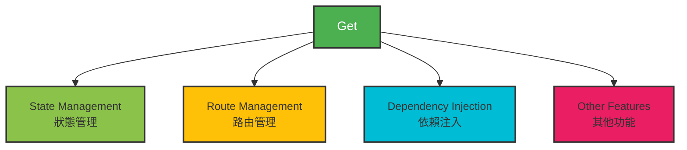
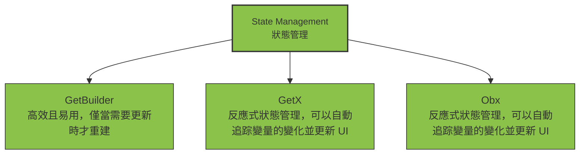
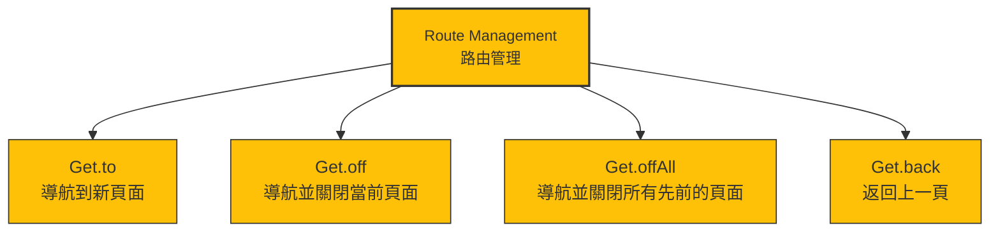
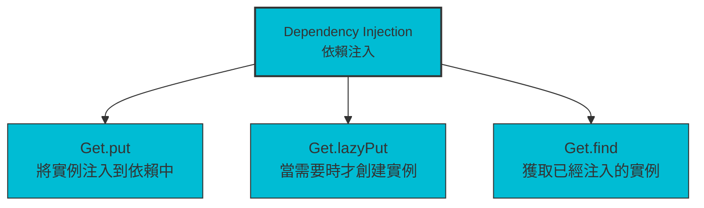
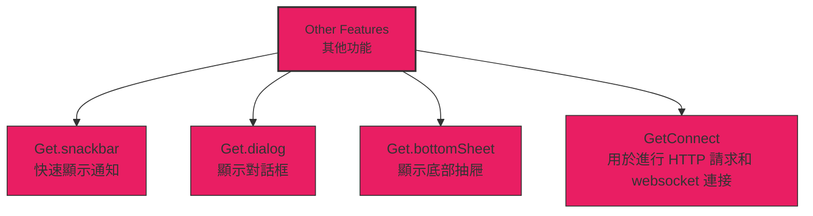

# Flutter GetX
`get` 是 Flutter 的一個輕量級且功能強大的狀態管理、路由和依賴注入套件。以下是 `get` 套件的主要特點和功能：



### 狀態管理 (State Management)
`get` 提供了一種簡單易用的狀態管理解決方案，無需上下文（context）即可更新 UI。主要使用 `GetBuilder`、`GetX` 和 `Obx` 等小部件來進行狀態管理：

- **GetBuilder**: 高效且易用，僅當需要更新時才重建。
- **GetX** 和 **Obx**: 反應式狀態管理，可以自動追踪變量的變化並更新 UI。


### 路由管理 (Route Management)
`get` 簡化了路由的使用，提供了一種無需上下文的導航方式。可以輕鬆地定義、管理和導航不同的頁面：

- **Get.to()**: 導航到新頁面。
- **Get.off()**: 導航並關閉當前頁面。
- **Get.offAll()**: 導航並關閉所有先前的頁面。
- **Get.back()**: 返回上一頁。


### 依賴注入 (Dependency Injection)
`get` 提供了一種簡單高效的依賴注入方式，使得在任何地方都可以輕鬆獲取和管理依賴：

- **Get.put()**: 將實例注入到依賴中。
- **Get.lazyPut()**: 當需要時才創建實例。
- **Get.find()**: 獲取已經注入的實例。

### 其他功能
除了以上的主要功能，`get` 還提供了以下一些實用功能：

- **GetBuilder** 和 **SimpleBuilder**: 簡單易用的狀態管理小部件。
- **Get.snackbar()**: 快速顯示通知。
- **Get.dialog()**: 顯示對話框。
- **Get.bottomSheet()**: 顯示底部抽屜。
- **GetConnect**: 用於進行 HTTP 請求和 websocket 連接。



### 安裝
在 `pubspec.yaml` 文件中添加 `get` 依賴：

```yaml
dependencies:
  flutter:
    sdk: flutter
  get: ^4.3.8
```

然後運行 `flutter pub get` 來安裝依賴。
